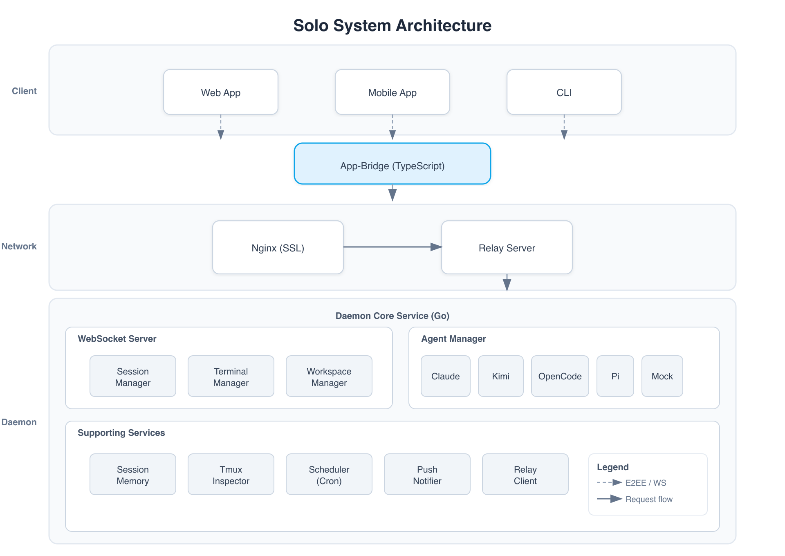

# Solo

📄 [中文版本](README.zh-CN.md)

Solo is an AI coding assistant platform that connects your local development environment with AI providers through a secure, end-to-end encrypted architecture. It consists of a local daemon, a relay server for remote connectivity, a cross-platform mobile/web app, and a CLI tool.

---

## Architecture

### System Architecture



> A higher-resolution SVG is available at [`docs/architecture/solo-system-architecture.svg`](docs/architecture/solo-system-architecture.svg).

<details>
<summary>ASCII version (for text-only environments)</summary>

```
┌─────────────────────────────────────────────────────────────┐
│                        Client Layer                         │
├─────────────────────────────────────────────────────────────┤
│  ┌─────────────┐  ┌─────────────┐  ┌─────────────┐         │
│  │   Web App   │  │ Mobile App  │  │    CLI      │         │
│  └──────┬──────┘  └──────┬──────┘  └──────┬──────┘         │
└─────────┼────────────────┼────────────────┼────────────────┘
          └────────────────┴────────────────┘
                         │
                ┌────────▼────────┐
                │   App-Bridge    │
                └────────┬────────┘
                         │
┌────────────────────────▼────────────────────────────────────┐
│                     Network Layer                           │
├─────────────────────────────────────────────────────────────┤
│  ┌─────────────────────────────────────────────────────┐   │
│  │              Nginx (optional)                        │   │
│  └────────────────────────┬────────────────────────────┘   │
│                           │                                  │
│  ┌────────────────────────▼────────────────────────────┐   │
│  │            Relay Server (signaling relay)            │   │
│  └────────────────────────┬────────────────────────────┘   │
└───────────────────────────┼──────────────────────────────────┘
                            │
┌───────────────────────────▼──────────────────────────────────┐
│                      Service Layer                           │
│                     Daemon (core service)                    │
├─────────────────────────────────────────────────────────────┤
│  ┌─────────────────────────────────────────────────────┐   │
│  │              WebSocket Server                        │   │
│  │  ┌─────────────┐ ┌─────────────┐ ┌───────────────┐ │   │
│  │  │   Session   │ │   Terminal  │ │   Workspace   │ │   │
│  │  │   Manager   │ │   Manager   │ │    Manager    │ │   │
│  │  └──────┬──────┘ └─────────────┘ └───────────────┘ │   │
│  └─────────┼────────────────────────────────────────────┘   │
│            │                                                  │
│  ┌─────────▼────────────────────────────────────────────┐   │
│  │              Agent Manager                           │   │
│  │  ┌────────┐ ┌────────┐ ┌──────────┐ ┌─────┐        │   │
│  │  │ Claude │ │  Kimi  │ │ OpenCode │ │  Pi │ Mock...│   │
│  │  └────────┘ └────────┘ └──────────┘ └─────┘        │   │
│  └─────────────────────────┬─────────────────────────────┘   │
│                            │                                  │
│  ┌─────────────────────────▼─────────────────────────────┐   │
│  │  ┌──────────────┐ ┌──────────────┐ ┌───────────────┐ │   │
│  │  │Session Memory│ │Tmux Inspector│ │   Scheduler   │ │   │
│  │  │(TurnRecorder │ │              │ │   (Cron)      │ │   │
│  │  │ / Redaction) │ │              │ │               │ │   │
│  │  └──────────────┘ └──────────────┘ └───────────────┘ │   │
│  │  ┌──────────────┐ ┌──────────────┐ ┌───────────────┐ │   │
│  │  │Push Notifier │ │ Relay Client │ │ Loop Engine   │ │   │
│  │  │              │ │              │ │ (Autonomous)  │ │   │
│  │  └──────────────┘ └──────────────┘ └───────────────┘ │   │
│  └───────────────────────────────────────────────────────┘   │
└─────────────────────────────────────────────────────────────┘
```

</details>

### Core Components

| Component | Directory | Language | Responsibility |
|-----------|-----------|----------|----------------|
| **App** | [`app/`](app/) | TypeScript / React Native | User interface (iOS, Android, Web) |
| **App-Bridge** | [`app-bridge/`](app-bridge/) | TypeScript | Client-side communication library |
| **Daemon** | [`daemon/`](daemon/) | Go | Core service — manages sessions, agents, loops, and provider connections |
| **Relay** | [`relay-go/`](relay-go/) | Go | Connection relay for remote/mobile access |
| **CLI** | [`cli/`](cli/) | Go | Command-line tool for session and agent management |
| **Protocol** | [`protocol/`](protocol/) | Go | Shared protocol definitions |

---

## Tech Stack

| Layer | Technology |
|-------|------------|
| Backend | Go 1.25 · gorilla/websocket · creack/pty · slog |
| Frontend | Expo 54 · React Native 0.81 · React 19 · TypeScript |
| State Management | Zustand · @tanstack/react-query · React Context |
| Styling | Unistyles (dynamic theming) |
| Terminal | @xterm/xterm v6 |
| Cryptography | X25519 key exchange + XSalsa20-Poly1305 (E2EE) |
| Testing | Vitest · Playwright (E2E) · Go test |
| Deployment | Systemd · Docker · Nginx + Let's Encrypt |
| CI/CD | GitHub Actions · golangci-lint v2 · ESLint |

---

## Quick Start

### Prerequisites

- [Go](https://go.dev/) 1.25+
- [Node.js](https://nodejs.org/) 20+
- [Expo CLI](https://docs.expo.dev/get-started/installation/) (for mobile/web development)

### Build

```bash
# Build all Darwin binaries (daemon, relay, CLI)
make darwin

# Build all Linux binaries
make linux

# Build everything
make all
```

Output binaries are placed in `output/darwin/` and `output/linux/`.

### Development

```bash
# Start daemon + web app together
make dev

# Start only the web app
make dev-web

# Start only the daemon (must build first)
make dev-daemon

# Restart the daemon
make restart

# Stop all dev processes
make stop
```

- **Daemon** listens on `127.0.0.1:17612`
- **Web app** runs on `http://localhost:19000`

### Run Tests

```bash
# Go tests (all modules)
cd protocol && go test -short -race ./...
cd cli && go test -short -race ./...
cd daemon && go test -short -race ./...
cd relay-go && go test -short -race ./...

# JavaScript / TypeScript tests
npm run lint
npm run test --workspaces --if-present
```

---

## Project Structure

```
solo/
├── app/                 # React Native / Expo application
├── app-bridge/          # Client communication library
├── cli/                 # Go CLI tool
├── daemon/              # Go core service
├── docs/                # Architecture & product documentation
├── packages/highlight/  # Shared syntax highlighting package
├── protocol/            # Go protocol definitions
├── relay-go/            # Go relay server
├── Makefile             # Build & development commands
├── go.work              # Go workspace
└── package.json         # Node.js workspace root
```

For detailed documentation, see [`docs/README.md`](docs/README.md).

---

## Supported AI Providers

- **Claude** — print / stream-json mode
- **Kimi** — Wire mode (JSON-RPC 2.0 over stdio)
- **OpenCode** — SSE mode
- **Pi** — JSON stream mode (stdio)
- **Codex** — definition only
- **Mock** — for testing

**Planned**: Cursor-Agent (Print mode). See [`docs/providers/`](docs/providers/) for provider integration research and planned additions.

---

## Session Memory

The daemon persists every user/assistant turn of every session to disk as Markdown with YAML frontmatter, giving you a local, queryable transcript of everything Solo has done.

- **Storage**: `~/.solo/memory/sessions/{YYYY-MM-DD}/{sessionID}/turns/{seq:04d}-{role}.md`
- **Index**: `~/.solo/memory/sessions.jsonl` (one JSONL line per session)
- **Streaming**: an assistant streaming response is coalesced into a **single** `assistant.md` per logical turn — you never end up with dozens of files for one answer.
- **Redaction**: OpenAI / GitHub / Anthropic / AWS tokens and common env-file secrets are replaced with `[redacted:<reason>]` before writing.
- **Isolation**: the recorder runs behind a `SafeBridge` wrapper that recovers from panics and trips a circuit breaker on repeated failures, so a storage problem can never take down the daemon's main session loop.

### Configuration

Session memory is **on by default**. To opt out, add to `~/.solo/config.json`:

```json
{
  "memory": { "enabled": false }
}
```

Other knobs (`backend`, `root`, `retention_days`, `queue_size`, `overflow`, `redact.*`, `safe.failure_threshold`, `safe.failure_cooldown`) are documented in [`docs/product/session-memory-spec.md`](docs/product/session-memory-spec.md).

---

## Tmux Dashboard

The app includes a Tmux Dashboard that automatically detects AI agents running in tmux sessions and provides interactive control.

### Agent Detection

Three-layer detection identifies agents even when `pane_current_command` reports a different process name (e.g., `node` for pi):

1. **Command name** — matches `claude`, `pi`, `kimi`, `kimi-cli`, `opencode`, `qodercli`, `cursor`
2. **Pane title** — unicode normalization (e.g., `π` → `pi`) with word-boundary matching
3. **Child process inspection** — `pgrep`/`ps` fallback for wrapped launchers

### Features

- **New session creation** — create new tmux sessions directly from the dashboard with optional working directory and command
- **Agent cards** — grouped by agent name with session badge (session name, window, pane), tap to filter
- **Non-agent pane display** — browse and interact with non-agent tmux panes (shells, editors, etc.) grouped by command
- **Command history** — track and display recent commands sent to coding agents, with delete support for stale entries
- **Session management** — close (kill) tmux sessions with confirmation dialog from agent/pane cards
- **Pane content capture** — live terminal view (last 500 lines), auto-refreshes every 5 seconds
- **Terminal themes** — configurable color themes (system, dark, light, tmux, Bash, auto) for pane rendering
- **Interactive control** — send text commands with Enter, or use quick-action buttons:
  - Arrow keys (↑↓←→) for TUI menu navigation
  - Enter, Esc, Tab, Ctrl+C for control
  - Number keys (1–4) for TUI menu selection

### Supported Agents

| Agent | Detection Method |
|-------|-----------------|
| claude | command / title |
| pi | command / title (π unicode) / child process |
| kimi | command / title |
| kimi-cli | command / title |
| opencode | command / title |
| qodercli | command |
| cursor | command |

---

## Schedule Automation

Solo includes a timezone-aware cron scheduling system for running automated tasks with AI agents.

- **Timezone-aware cron** — users input schedules in their local timezone; expressions are stored as UTC and evaluated directly in UTC to avoid double-conversion bugs
- **Friendly UI** — create, edit, list, and view scheduled tasks with frequency presets, time inputs, and timezone display
- **Readable descriptions** — cadences are shown in friendly text (e.g., "Daily at 00:25") alongside the raw UTC expression
- **Agent targeting** — assign schedules to existing agents or create new ones for each run
- **Execution history** — full run record tracking for every scheduled task
- **Self-healing** — stale `nextRunAt` values are automatically repaired on daemon load

---

## Loop Automation

Solo includes an LLM-driven loop system that evolves scheduled tasks into autonomous iteration loops.

- **Full CRUD** — create, inspect, update, run, stop, and delete loops from the app or CLI
- **App UI** — dedicated screens for loop list, detail, and creation in the sidebar
- **CLI commands** — `solo-cli loop ls|run|status|stop|update|delete`
- **Provider integration** — loops use existing AI providers to execute iteration steps
- **Execution tracking** — full run history and status monitoring

---

## Security

- **End-to-End Encryption**: All communication between client and daemon is encrypted using X25519 key exchange + XSalsa20-Poly1305.
- **Pairing Link**: Secure pairing via `https://solo.up2ai.top/#offer={base64url(ConnectionOfferV2)}`.

---

## CI/CD

The project uses GitHub Actions (`.github/workflows/ci.yml`) with the following jobs:

| Job | Trigger | Steps |
|-----|---------|-------|
| **Go** (matrix: protocol, cli, daemon, relay-go) | push/PR to main | `go mod verify` → `go build` → `go test -short -race -coverprofile` → `golangci-lint v2` → Codecov upload |
| **JS** | push/PR to main | `npm ci` → lint (app, app-bridge, highlight) → typecheck → test (app 1663 tests, app-bridge 32 tests) → Codecov upload |
| **E2E** (nightly) | daily 02:00 UTC + manual | Playwright E2E (35 specs) with daemon/relay/Metro globalSetup |

---

## Documentation

- [Architecture Overview](docs/architecture/README.md)
- [Component Specifications](docs/architecture/components.md)
- [Data Flow & Session Lifecycle](docs/architecture/data-flow.md)
- [Network Architecture](docs/architecture/network-architecture.md)
- [Session Memory Persistence](docs/architecture/session-memory-persistence.md)
- [Agent Stall Detection](docs/architecture/agent-stall-detection.md)
- [Push Notifications](docs/architecture/push-notifications.md)
- [Deployment Guide](docs/architecture/deployment.md)
- [Product Features](docs/product/features.md)
- [Session Memory Spec](docs/product/session-memory-spec.md)

---

## License

[Add your license here]
