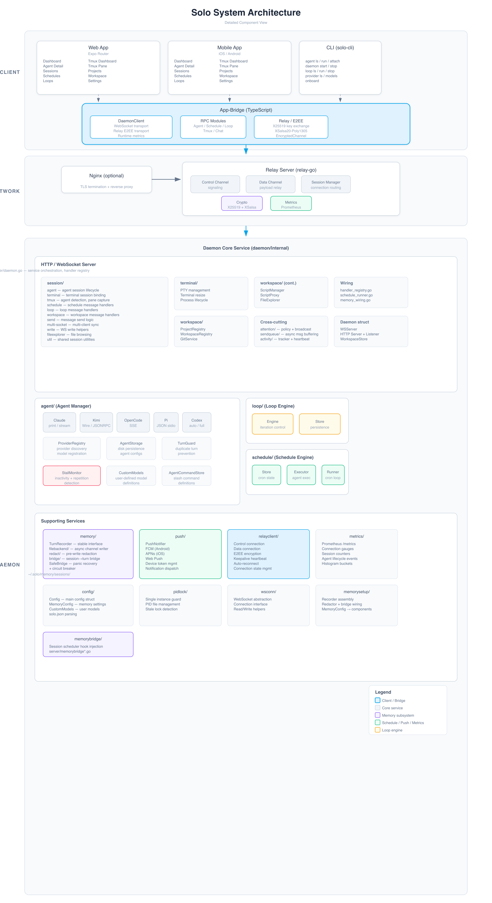

# Solo

📄 [English Version](README.md)

Solo 是一个 AI 编程助手平台，通过安全、端到端加密的架构将您的本地开发环境与 AI 服务提供商连接起来。它由本地守护进程、用于远程连接的转发服务器、跨平台移动/网页应用以及 CLI 工具组成。

---

## 架构

### 系统架构



> 概览图: [PNG](docs/architecture/solo-system-architecture.png) | [SVG](docs/architecture/solo-system-architecture.svg).
> 详细图 (上方): [SVG](docs/architecture/solo-system-architecture-detailed.svg) | [PNG](docs/architecture/solo-system-architecture-detailed.png).

<details>
<summary>ASCII 版本（纯文本环境）</summary>

```
┌──────────────────────────────────────────────────────────────────────────┐
│                              客户端层                                    │
├──────────────────────────────────────────────────────────────────────────┤
│  ┌──────────────────┐  ┌──────────────────┐  ┌──────────────────┐       │
│  │     网页应用      │  │    移动应用      │  │       CLI        │       │
│  │  (Expo Router)   │  │  (iOS / Android) │  │   (solo-cli)     │       │
│  │                  │  │                  │  │                  │       │
│  │  页面:           │  │  页面:           │  │  命令:           │       │
│  │  · 仪表板        │  │  · 仪表板        │  │  · agent ls/run  │       │
│  │  · 代理详情      │  │  · 代理详情      │  │  · daemon start  │       │
│  │  · 会话          │  │  · 会话          │  │  · loop ls/run   │       │
│  │  · 定时任务      │  │  · 定时任务      │  │  · provider ls   │       │
│  │  · 循环          │  │  · 循环          │  │  · onboard       │       │
│  │  · Tmux 仪表板   │  │  · Tmux 仪表板   │  │                  │       │
│  │  · Tmux 窗格     │  │  · Tmux 窗格     │  │                  │       │
│  │  · 项目          │  │  · 项目          │  │                  │       │
│  │  · 工作区        │  │  · 工作区        │  │                  │       │
│  │  · 设置          │  │  · 设置          │  │                  │       │
│  └────────┬─────────┘  └────────┬─────────┘  └────────┬─────────┘       │
│           └──────────────────────┴──────────────────────┘                │
│                                  │                                       │
│                    ┌─────────────▼──────────────┐                        │
│                    │        App-Bridge          │                        │
│                    │  ┌──────────────────────┐  │                        │
│                    │  │    DaemonClient      │  │                        │
│                    │  │  · WebSocket 传输    │  │                        │
│                    │  │  · 转发 E2EE 传输    │  │                        │
│                    │  │  · 运行时指标        │  │                        │
│                    │  └──────────────────────┘  │                        │
│                    │  ┌────────────┐ ┌────────┐ │                        │
│                    │  │ 代理 RPC   │ │ Tmux   │ │                        │
│                    │  │ 定时任务   │ │ RPC    │ │                        │
│                    │  │ 循环 RPC   │ │ 聊天   │ │                        │
│                    │  └────────────┘ └────────┘ │                        │
│                    │  ┌──────────────────────┐  │                        │
│                    │  │   转发 / E2EE        │  │                        │
│                    │  │  · X25519 + XSalsa  │  │                        │
│                    │  │  · EncryptedChannel  │  │                        │
│                    │  └──────────────────────┘  │                        │
│                    └─────────────┬──────────────┘                        │
│                                  │                                       │
┌──────────────────────────────────▼───────────────────────────────────────┐
│                             网络层                                       │
├──────────────────────────────────────────────────────────────────────────┤
│  ┌──────────────────────────────────────────────────────────────────┐   │
│  │                      Nginx (可选)                                │   │
│  │                 TLS 终止 · 反向代理                               │   │
│  └───────────────────────────────┬──────────────────────────────────┘   │
│                                  │                                       │
│  ┌───────────────────────────────▼──────────────────────────────────┐   │
│  │                    转发服务器 (relay-go)                          │   │
│  │  ┌──────────────┐ ┌──────────────┐ ┌──────────────┐             │   │
│  │  │   控制通道    │ │   数据通道    │ │   会话管理    │             │   │
│  │  └──────────────┘ └──────────────┘ └──────────────┘             │   │
│  │  ┌──────────────┐ ┌──────────────┐                              │   │
│  │  │    加密       │ │    指标      │                              │   │
│  │  │ (X25519+XS)  │ │ (Prometheus) │                              │   │
│  │  └──────────────┘ └──────────────┘                              │   │
│  └───────────────────────────────┬──────────────────────────────────┘   │
└──────────────────────────────────┼───────────────────────────────────────┘
                                   │
┌──────────────────────────────────▼───────────────────────────────────────┐
│                             服务层                                       │
│                      守护进程 (daemon/internal)                          │
├──────────────────────────────────────────────────────────────────────────┤
│                                                                          │
│  ┌─────────────────── HTTP / WebSocket 服务器 ────────────────────────┐ │
│  │  ┌────────────────────────────────────────────────────────────┐   │ │
│  │  │  server/daemon.go — 服务编排、处理器注册                    │   │ │
│  │  └────────────────────────────────────────────────────────────┘   │ │
│  │  ┌──────────────┐ ┌──────────────┐ ┌────────────────────────┐   │ │
│  │  │   session/   │ │  terminal/   │ │      workspace/        │   │ │
│  │  │  · agent     │ │  · PTY 管理  │ │  · ProjectRegistry     │   │ │
│  │  │  · terminal  │ │  · 调整大小   │ │  · WorkspaceRegistry   │   │ │
│  │  │  · tmux      │ │              │ │  · GitService          │   │ │
│  │  │  · schedule  │ │              │ │  · ScriptManager       │   │ │
│  │  │  · loop      │ │              │ │  · FileExplorer        │   │ │
│  │  │  · workspace │ │              │ │  · ScriptProxy         │   │ │
│  │  │  · send      │ │              │ │                        │   │ │
│  │  │  · multi-    │ │              │ │                        │   │ │
│  │  │    socket    │ │              │ │                        │   │ │
│  │  └──────────────┘ └──────────────┘ └────────────────────────┘   │ │
│  │  ┌──────────────┐ ┌──────────────┐ ┌──────────────┐             │ │
│  │  │  attention/  │ │  sendqueue/  │ │  activity/   │             │ │
│  │  │  策略 + 广播 │ │  异步消息    │ │  活动跟踪    │             │ │
│  │  └──────────────┘ └──────────────┘ └──────────────┘             │ │
│  └──────────────────────────────────────────────────────────────────┘ │
│                                                                       │
│  ┌──────────────────── agent/ (代理管理器) ─────────────────────────┐ │
│  │  ┌─────────┐ ┌─────────┐ ┌──────────┐ ┌──────┐ ┌──────────┐   │ │
│  │  │ Claude  │ │  Kimi   │ │ OpenCode │ │  Pi  │ │  Codex   │   │ │
│  │  │ (print/ │ │ (Wire/  │ │  (SSE)   │ │(JSON │ │(auto/    │   │ │
│  │  │ stream) │ │ JSONRPC)│ │          │ │stdio)│ │full-acc) │   │ │
│  │  └─────────┘ └─────────┘ └──────────┘ └──────┘ └──────────┘   │ │
│  │  ┌──────────────┐ ┌──────────────┐ ┌──────────────┐            │ │
│  │  │  ProviderReg │ │  AgentStore  │ │  TurnGuard   │            │ │
│  │  │  提供商发现   │ │  持久化存储  │ │  去重保护    │            │ │
│  │  └──────────────┘ └──────────────┘ └──────────────┘            │ │
│  │  ┌──────────────┐ ┌──────────────┐                             │ │
│  │  │ StallMonitor │ │ CustomModels │                             │ │
│  │  │ 停滞检测     │ │ 用户自定义   │                             │ │
│  │  └──────────────┘ └──────────────┘                             │ │
│  └─────────────────────────────────────────────────────────────────┘ │
│                                                                       │
│  ┌────────────────── loop/ (循环引擎) ─────────────────────────────┐ │
│  │  ┌──────────────┐ ┌──────────────┐                              │ │
│  │  │   Engine     │ │    Store     │                              │ │
│  │  │  迭代执行    │ │  持久化存储  │                              │ │
│  │  └──────────────┘ └──────────────┘                              │ │
│  └──────────────────────────────────────────────────────────────────┘ │
│                                                                       │
│  ┌────────────────── schedule/ (调度引擎) ─────────────────────────┐ │
│  │  ┌──────────────┐ ┌──────────────┐ ┌──────────────┐            │ │
│  │  │    Store     │ │   Executor   │ │    Runner    │            │ │
│  │  │  cron 状态   │ │  代理执行    │ │  cron 循环   │            │ │
│  │  └──────────────┘ └──────────────┘ └──────────────┘            │ │
│  └──────────────────────────────────────────────────────────────────┘ │
│                                                                       │
│  ┌─────────────── 支撑服务 ─────────────────────────────────────────┐ │
│  │  ┌──────────────┐ ┌──────────────┐ ┌──────────────┐            │ │
│  │  │   memory/    │ │    push/     │ │ relayclient/ │            │ │
│  │  │ TurnRecorder │ │  FCM / APNs  │ │  · 控制连接  │            │ │
│  │  │ filebackend  │ │  Web 推送    │ │  · 数据连接  │            │ │
│  │  │ redact/      │ │              │ │  · E2EE      │            │ │
│  │  │ bridge/      │ │              │ │  · 保活心跳  │            │ │
│  │  │ SafeBridge   │ │              │ │  · 自动重连  │            │ │
│  │  └──────────────┘ └──────────────┘ └──────────────┘            │ │
│  │  ┌──────────────┐ ┌──────────────┐ ┌──────────────┐            │ │
│  │  │  metrics/    │ │   config/    │ │   pidlock/   │            │ │
│  │  │  Prometheus  │ │ MemoryConfig │ │  单实例守护  │            │ │
│  │  │  /metrics    │ │ CustomModels │ │              │            │ │
│  │  └──────────────┘ └──────────────┘ └──────────────┘            │ │
│  │  ┌──────────────┐ ┌──────────────┐                              │ │
│  │  │  wsconn/     │ │ memorysetup/ │                              │ │
│  │  │  WS 连接     │ │  接线 + 组装 │                              │ │
│  │  │  抽象层      │ │              │                              │ │
│  │  └──────────────┘ └──────────────┘                              │ │
│  └──────────────────────────────────────────────────────────────────┘ │
└─────────────────────────────────────────────────────────────────────────┘
```

</details>

### 核心组件

| 组件 | 目录 | 语言 | 职责 |
|------|------|------|------|
| **应用** | [`app/`](app/) | TypeScript / React Native | 用户界面 (iOS, Android, Web) |
| **应用桥接** | [`app-bridge/`](app-bridge/) | TypeScript | 客户端通信库 |
| **守护进程** | [`daemon/`](daemon/) | Go | 核心服务 — 管理会话、代理、循环和提供商连接 |
| **转发** | [`relay-go/`](relay-go/) | Go | 用于远程/移动访问的连接转发 |
| **CLI** | [`cli/`](cli/) | Go | 用于会话和代理管理的命令行工具 |
| **协议** | [`protocol/`](protocol/) | Go | 共享协议定义 |
| **语法高亮** | [`packages/highlight/`](packages/highlight/) | TypeScript | 语法高亮库 |
| **Tmux 子系统** | `daemon/internal/server/session_tmux.go` | Go | Tmux 代理检测、窗格捕获、按键注入 |
| **SVG 预览** | `app/src/components/svg-preview*.tsx` | TypeScript | SVG 文件预览（移动端用 WebView，Web 端用原生渲染） |

---

## 技术栈

| 层级 | 技术 |
|------|------|
| 后端 | Go 1.25 · gorilla/websocket · creack/pty · slog |
| 前端 | Expo 54 · React Native 0.81 · React 19 · TypeScript |
| 状态管理 | Zustand · @tanstack/react-query · React Context |
| 样式 | Unistyles (动态主题) |
| 终端 | @xterm/xterm v6 |
| 加密 | X25519 密钥交换 + XSalsa20-Poly1305 (E2EE) |
| 测试 | Vitest · Playwright (E2E) · Go test |
| 部署 | Systemd · Docker · Nginx + Let's Encrypt |
| CI/CD | GitHub Actions · golangci-lint v2 · ESLint |

---

## 快速开始

### 前置要求

- [Go](https://go.dev/) 1.25+
- [Node.js](https://nodejs.org/) 20+
- [Expo CLI](https://docs.expo.dev/get-started/installation/) (用于移动/网页开发)

### 构建

```bash
# 构建所有 Darwin 二进制文件 (守护进程, 转发, CLI)
make darwin

# 构建所有 Linux 二进制文件
make linux

# 构建所有内容
make all
```

输出二进制文件放置在 `output/darwin/` 和 `output/linux/` 中。

### 开发

```bash
# 同时启动守护进程 + 网页应用
make dev

# 仅启动网页应用
make dev-web

# 仅启动守护进程 (必须先构建)
make dev-daemon

# 重启守护进程
make restart

# 停止所有开发进程
make stop

# 以转发模式启动网页应用
make dev-web-relay

# 构建并在后台运行守护进程
make run-daemon

# 停止所有开发进程并删除所有代理会话
make stop-all
```

- **守护进程** 监听 `127.0.0.1:17612`
- **网页应用** 运行在 `http://localhost:19000`

### 部署

```bash
# 部署转发服务器到远程服务器 (交叉编译、SCP、重启 systemd)
make deploy-solo-relay

# 配置本地守护进程使用转发服务器
make use-solo-relay

# 检查转发服务器和守护进程配置状态
make relay-status
```

### 测试、Lint、类型检查

```bash
# 完整 CI 流水线 (lint + test + typecheck)
make ci

# Go 测试 (所有模块，含竞态检测)
make test-go

# JavaScript / TypeScript 测试 (app + app-bridge + highlight)
make test-app

# Lint 所有 JS/TS 包
make lint

# TypeScript 类型检查
make typecheck

# 单独的 Go 模块测试
cd protocol && go test -short -race ./...
cd cli && go test -short -race ./...
cd daemon && go test -short -race ./...
cd relay-go && go test -short -race ./...
```

---

## 项目结构

```
solo/
├── app/                 # React Native / Expo 应用
├── app-bridge/          # 客户端通信库
├── cli/                 # Go CLI 工具
├── daemon/              # Go 核心服务
├── docs/                # 架构与产品文档
├── packages/highlight/  # 共享语法高亮包
├── protocol/            # Go 协议定义
├── relay-go/            # Go 转发服务器
├── Makefile             # 构建与开发命令
├── go.work              # Go 工作区
└── package.json         # Node.js 工作区根目录
```

详细文档请参见 [`docs/README.md`](docs/README.md)。

---

## 支持的 AI 提供商

- **Claude** — print / stream-json 模式
- **Kimi** — Wire 模式 (JSON-RPC 2.0 over stdio)
- **OpenCode** — SSE 模式
- **Pi** — JSON stream 模式 (stdio)
- **Codex** — auto / full-access 模式
- **Mock** — 仅开发/测试用途 (通过 `SOLO_ENABLE_MOCK_PROVIDER=1` 启用)

**计划中**: Cursor-Agent (Print 模式)。有关提供商集成研究和计划添加的内容，请参见 [`docs/providers/`](docs/providers/)。

---

## 会话记忆

守护进程将每个会话的每次用户/助手对话持久化到磁盘，格式为带 YAML 前置信息的 Markdown，为您提供 Solo 所做一切的本地、可查询的转录记录。

- **存储**: `~/.solo/memory/sessions/{YYYY-MM-DD}/{sessionID}/turns/{seq:04d}-{role}.md`
- **索引**: `~/.solo/memory/sessions.jsonl` (每个会话一行 JSONL)
- **流式处理**: 助手流式响应被合并为每个逻辑回合的**单个** `assistant.md` — 您不会因为一个答案而得到几十个文件。
- **脱敏**: OpenAI / GitHub / Anthropic / AWS 令牌和常见的 env-file 密钥在写入前会被替换为 `[redacted:<reason>]`。
- **隔离**: 记录器在 `SafeBridge` 包装器后运行，该包装器可以从 panic 中恢复并在重复失败时触发断路器，因此存储问题永远不会导致守护进程的主会话循环崩溃。

### 配置

会话记忆**默认开启**。要选择退出，请添加到 `~/.solo/config.json`：

```json
{
  "memory": { "enabled": false }
}
```

其他配置项 (`backend`, `root`, `retention_days`, `queue_size`, `overflow`, `redact.*`, `safe.failure_threshold`, `safe.failure_cooldown`) 记录在 [`docs/product/session-memory-spec.md`](docs/product/session-memory-spec.md) 中。

---

## Tmux 仪表板

应用内置 Tmux 仪表板，可自动检测在 tmux 会话中运行的 AI 代理，并提供交互式控制。

### 代理检测

三层检测机制确保即使 `pane_current_command` 报告不同的进程名（例如 pi 报告为 `node`）也能识别代理：

1. **命令名** — 匹配 `claude`、`pi`、`kimi`、`kimi-cli`、`opencode`、`qodercli`、`cursor`
2. **窗格标题** — Unicode 归一化（如 `π` → `pi`）配合词边界匹配
3. **子进程检查** — 通过 `pgrep`/`ps` 回退检测包装启动器

### 功能

- **新建会话** — 直接从仪表板创建新的 tmux 会话，支持可选的工作目录和命令
- **代理卡片** — 按代理名称分组，显示会话徽章（会话名、窗口、窗格），点击可筛选
- **非代理窗格显示** — 浏览和交互非代理 tmux 窗格（shell、编辑器等），按命令分组
- **命令历史** — 跟踪和显示发送给编程代理的最近命令，支持删除过期条目
- **会话管理** — 关闭（kill）tmux 会话，代理/窗格卡片带确认对话框
- **窗格内容捕获** — 实时终端视图（最近 500 行），每 5 秒自动刷新
- **终端主题** — 可配置的颜色主题（系统、深色、浅色、tmux、Bash、自动）用于窗格渲染
- **交互式控制** — 发送文本命令（带 Enter），或使用快捷操作按钮：
  - 方向键（↑↓←→）用于 TUI 菜单导航
  - Enter、Esc、Tab、Ctrl+C 用于控制
  - 数字键（1–4）用于 TUI 菜单选择

### 支持的代理

| 代理 | 检测方式 |
|------|---------|
| claude | 命令 / 标题 |
| pi | 命令 / 标题（π unicode）/ 子进程 |
| kimi | 命令 / 标题 |
| kimi-cli | 命令 / 标题 |
| opencode | 命令 / 标题 |
| qodercli | 命令 |
| cursor | 命令 |
| codex | 命令 |

---

## 定时自动化

Solo 内置时区感知的 cron 调度系统，用于运行 AI 代理的自动化任务。

- **时区感知 cron** — 用户以本地时区输入计划；表达式以 UTC 存储并直接在 UTC 中求值，避免双重转换 bug
- **友好的界面** — 创建、编辑、列出和查看定时任务，支持频率预设、时间输入和时区显示
- **可读描述** — 以友好文本展示执行频率（如 "每日 00:25"），同时显示原始 UTC 表达式
- **代理定向** — 将计划分配给现有代理，或为每次运行创建新代理
- **执行历史** — 每个定时任务的完整运行记录
- **自愈** — 守护进程加载时自动修复过期的 `nextRunAt` 值

---

## 循环自动化

Solo 内置 LLM 驱动的循环系统，将定时任务进化为自治迭代循环。

- **完整 CRUD** — 从应用或 CLI 创建、查看、更新、运行、停止和删除循环
- **应用界面** — 侧边栏中专用的循环列表、详情和创建页面
- **CLI 命令** — `solo-cli loop ls|run|status|stop|update|delete`
- **提供商集成** — 循环使用现有 AI 提供商执行迭代步骤
- **执行跟踪** — 完整的运行历史和状态监控

---

## CLI 参考

Solo 包含一个全面的 CLI (`solo-cli`)，具有以下命令组：

| 组 | 命令 | 描述 |
|----|------|------|
| **agent** | `ls`, `run`, `attach`, `send`, `stop`, `inspect`, `logs`, `mode`, `wait`, `archive`, `delete` | 代理生命周期和交互 |
| **daemon** | `start`, `stop`, `restart`, `status`, `pair` | 守护进程服务管理 |
| **loop** | `ls`, `run`, `stop`, `status`, `update`, `delete` | 循环自动化管理 |
| **provider** | `ls`, `models` | 提供商和模型发现 |
| | `onboard`, `shortcuts` | 设置和键盘快捷键 |

---

## 安全

- **端到端加密**: 客户端和守护进程之间的所有通信都使用 X25519 密钥交换 + XSalsa20-Poly1305 进行加密。
- **配对链接**: 通过 `https://solo.up2ai.top/#offer={base64url(ConnectionOfferV2)}` 进行安全配对。

---

## CI/CD

该项目使用 GitHub Actions (`.github/workflows/ci.yml`)，包含以下任务：

| 任务 | 触发条件 | 步骤 |
|------|---------|------|
| **Go** (矩阵: protocol, cli, daemon, relay-go) | push/PR 到 main | `go mod verify` → `go build` → `go test -short -race -coverprofile` → `golangci-lint v2` → Codecov 上传 |
| **JS** | push/PR 到 main | `npm ci` → lint (app, app-bridge, highlight) → typecheck → test (app 1663 测试, app-bridge 32 测试) → Codecov 上传 |
| **E2E** (每日) | 每日 02:00 UTC + 手动 | Playwright E2E (38 个测试规格) 含 daemon/relay/Metro globalSetup |

---

## 文档

- [文档索引](docs/README.md) — 所有文档的主索引
- [架构概览](docs/architecture/README.md)
- [组件规范](docs/architecture/components.md)
- [数据流与会话生命周期](docs/architecture/data-flow.md)
- [网络架构](docs/architecture/network-architecture.md)
- [会话记忆持久化](docs/architecture/session-memory-persistence.md)
- [代理停滞检测](docs/architecture/agent-stall-detection.md)
- [推送通知](docs/architecture/push-notifications.md)
- [部署指南](docs/architecture/deployment.md)
- [产品功能](docs/product/features.md)
- [2026 路线图](docs/product/roadmap-2026.md)
- [会话记忆规范](docs/product/session-memory-spec.md)
- [技术分析](docs/analysis/README.md)

---

## 许可证

[在此处添加您的许可证]
