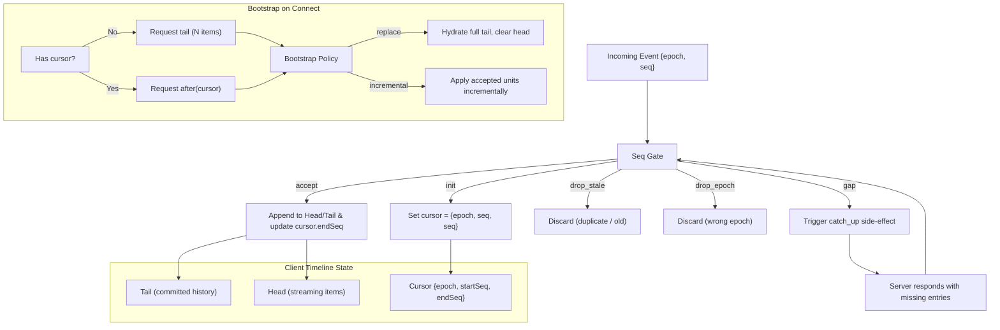

# Solo Timeline（时间线）设计详解

> **相关源码**: `app/src/contexts/session-timeline-*.ts`, `app/src/types/stream.ts`, `app/src/contexts/session-stream-reducers.ts`, `app/src/stores/session-store.ts`

## 1. 设计目标

Solo 的 Timeline 设计主要解决以下核心问题：

- **流式对话状态管理**：高效处理 Agent 实时生成的对话流（streaming）。
- **历史同步与一致性**：在断线重连、应用恢复、初始加载时保证客户端与服务器历史记录的一致性。
- **竞态条件处理**：处理初始化请求（bootstrap）与实时流事件（live events）之间的时序冲突。

---

## 2. 核心概念

| 概念 | 说明 |
|------|------|
| **Timeline** | Agent 对话历史的有序事件序列，每个事件通过 `epoch` + `seq` 全局唯一标识。 |
| **Epoch** | 标识一个 Timeline 的"时代"或版本，当服务器重置或切换上下文时变化。 |
| **Seq** | 单调递增的序列号，用于严格排序和连续性检测。 |
| **Direction** | Timeline 查询方向：`tail`（尾部/历史）、`before`（之前）、`after`（之后）。 |
| **Cursor** | 客户端已同步的位置标记，包含 `{ epoch, startSeq, endSeq }`。 |

---

## 3. 数据模型：Head / Tail 双缓冲架构

为了优化流式渲染性能，Timeline 状态被拆分为两个部分：

| 状态 | 含义 | 更新频率 | 持久性 |
|------|------|----------|--------|
| **Tail** (`agentStreamTail`) | 已提交的对话历史（canonical） | 低（仅在 flush 时追加） | 持久 |
| **Head** (`agentStreamHead`) | 正在流式传输中的活跃内容 | 高（逐字/逐块更新） | 临时 |

### 3.1 工作流程

1. 流式事件（如 `assistant_message`、`thought`）先写入 **Head**。
2. 当事件类型切换（如从 `assistant_message` 变为 `tool_call`）或收到完成事件（`turn_completed`/`turn_failed`/`turn_canceled`）时，Head 中的内容被 **Flush** 到 Tail。
3. 这种设计避免了在流式输出时频繁复制整个历史数组，只更新临时 Head。

### 3.2 Markdown 块提升优化

当 `assistant_message` 在流式传输时包含多个 Markdown 代码块，已完成的块会被提前提升到 Tail（`promoteCompletedAssistantBlocks`），减少 Head 的体积，优化渲染性能。

---

## 4. 序列号门控（Sequence Gate）

所有进入 Timeline 的事件都必须通过序列号检查，确保时序正确。

```
classifySessionTimelineSeq(cursor, epoch, seq):
  cursor 为空    → "init"      （初始化）
  epoch 不匹配   → "drop_epoch"（丢弃，时代错误）
  seq ≤ endSeq   → "drop_stale"（丢弃，过时/重复）
  seq = endSeq+1 → "accept"    （接受，连续）
  seq > endSeq+1 → "gap"       （间隙，需要 catch-up）
```

### Gap 处理

当检测到 `gap` 时，系统会触发 `catch_up` side effect，向服务器请求缺失的历史片段（`requestCanonicalCatchUp`）。

---

## 5. 初始化与 Bootstrap 策略

### 5.1 初始请求策略

`deriveInitialTimelineRequest` 决定首次加载时的请求方式：

- **冷启动**（无 cursor 或无 authoritative history）：请求 `direction: "tail"`，获取最近 N 条历史。
- **热恢复**（已有 cursor）：请求 `direction: "after"`，从 cursor 之后获取增量更新。

### 5.2 Bootstrap Tail 竞态处理

`deriveBootstrapTailTimelinePolicy` 专门处理一种棘手的竞态：

> **场景**：客户端正在初始化（发送 `tail` 请求），同时实时流已经在推送新事件（seq 可能已经远超 tail 范围）。

**策略**：

| 条件 | 行为 |
|------|------|
| `reset = true` | 全量替换（`replace: true`），无 catch-up。 |
| Bootstrap Tail Init（初始化中的 tail 响应） | `replace: true`，同时记录 `catchUpCursor`，用于后续填补初始化期间错过的实时事件。 |
| 其他情况 | 增量追加（`replace: false`）。 |

### 5.3 初始化解析

`shouldResolveTimelineInit` 确保初始化 Promise 只在匹配的响应到达时解析（`tail` 请求对应 `tail` 响应，防止乱序响应误触发初始化完成）。

---

## 6. 响应处理流程

### 6.1 批量响应处理：`processTimelineResponse`

处理服务器返回的批量 Timeline 数据（通常用于初始化或 catch-up）：

```
输入：payload（entries, direction, epoch, cursors）
      + 当前 tail/head/cursor + 初始化状态

1. 错误路径：拒绝 init，状态不变
2. 转换 entries 为 timelineUnits
3. 根据 bootstrapPolicy 决定 Replace 或 Incremental 路径
   - Replace Path：hydrateStreamState → 全量替换 tail，清空 head
   - Incremental Path：逐个 acceptIncrementalTimelineUnits
     → 连续事件 applyStreamEvent
     → 遇到 gap 时记录 catchUpCursor
4. 添加 flush_pending_updates side effect
5. 解析 init deferred（如果条件满足）
```

### 6.2 实时事件处理：`processAgentStreamEvent`

处理单个 WebSocket 实时事件：

```
1. Timeline Seq Gate 检查（如果是 timeline 事件）
   - init/accept → 更新 cursor
   - gap → 拒绝应用，触发 catch_up
   - drop_stale/drop_epoch → 直接丢弃
2. 通过 gate 后，applyStreamEvent（head/tail 模型）
3. 生命周期乐观更新（turn_completed 等事件更新 Agent 状态）
4. 返回新状态 + side effects
```

---

## 7. 事件队列与批处理

为避免高频实时事件导致 UI 频繁重渲染，系统使用了一个 **Reducer Queue**：

- **Enqueue**：事件按 Agent 分组进入待处理队列。
- **Schedule Flush**：使用 `setTimeout(48ms)` 批量刷新（约 20fps）。
- **Flush**：一次性处理队列中所有事件，生成最终状态 patch，减少 React 重渲染次数。

---

## 8. StreamItem 类型系统

Timeline 中的每个项目都是 `StreamItem` 联合类型：

| 类型 | 用途 | 可流式 |
|------|------|--------|
| `user_message` | 用户输入 | 否 |
| `assistant_message` | AI 回复 | **是** |
| `thought` | 推理过程 | **是** |
| `tool_call` | 工具调用 | 否 |
| `todo_list` | 待办列表 | 否 |
| `activity_log` | 系统日志 | 否 |
| `compaction` | 上下文压缩标记 | 否 |

**Source 标记**：每个事件带有 `source` 标记（`"live"` 实时流 / `"canonical"` 权威历史），用于区分数据来源。

---

## 9. 应用恢复与 Catch-up

当应用从后台恢复时（`handleAppResumed`）：

1. 如果离开超过 `HISTORY_STALE_AFTER_MS`（60秒），增加 history sync generation。
2. 如果有当前 Agent 的 cursor，发送 `fetchAgentTimeline(after, cursor)` 请求 catch-up 增量数据。

---

## 10. 架构总览图

### Mermaid 图



### ASCII 架构图（纯文本备用）

```
┌─────────────────────────────────────────────────────────────────┐
│                    Client Timeline State                         │
├─────────────────────────────────────────────────────────────────┤
│  ┌─────────────────────┐  ┌─────────────────────┐              │
│  │  Tail               │  │  Head               │              │
│  │  (committed history)│  │  (streaming items)  │              │
│  └─────────────────────┘  └─────────────────────┘              │
│  ┌─────────────────────────────────────────────────────────┐   │
│  │  Cursor {epoch, startSeq, endSeq}                       │   │
│  └─────────────────────────────────────────────────────────┘   │
└─────────────────────────────────────────────────────────────────┘
                              │
                              ▼
┌─────────────────────────────────────────────────────────────────┐
│                        Seq Gate                                  │
├─────────────────────────────────────────────────────────────────┤
│  init      →  Set cursor = {epoch, seq, seq}                    │
│  accept    →  Append to Head/Tail & update cursor.endSeq        │
│  drop_stale → Discard (duplicate / old)                         │
│  drop_epoch → Discard (wrong epoch)                             │
│  gap       →  Trigger catch_up side-effect                      │
└─────────────────────────────────────────────────────────────────┘
                              │
                              ▼
┌─────────────────────────────────────────────────────────────────┐
│                     Bootstrap on Connect                         │
├─────────────────────────────────────────────────────────────────┤
│  Has cursor?                                                    │
│    ├─ No  → Request tail (N items) ──┐                          │
│    └─ Yes → Request after(cursor) ───┤                          │
│                                      ▼                          │
│                            Bootstrap Policy                     │
│                              ├─ replace → Hydrate full tail     │
│                              └─ incremental → Apply units       │
└─────────────────────────────────────────────────────────────────┘
```

---

## 11. 后端存储与多端同步

### 11.1 共享存储模型

后端 `InMemoryTimelineStore` 是一个**全局共享单例**，所有 Session 共用同一个存储实例。Agent 运行产生的 `timeline` 事件通过以下链路写入存储：

```
Agent Session (dispatcher)
  → subscribeToSession (workCh)
    → agentMgr.handleStreamEvent
      → m.emit(event)  ──→ Session A.handleStreamEvent ──→ timelineStore.Append
                          → Session B.handleStreamEvent ──→ timelineStore.Append
                          → Session C.handleStreamEvent ──→ timelineStore.Append
```

**关键问题**：`m.emit()` 是同步顺序调用所有 Session 的 subscriber。每个 Session 的 `handleStreamEvent` 在收到 `timeline` 事件时都会独立调用 `timelineStore.Append()`。如果有 N 个 Session 同时在线，同一个 timeline item 会被追加 **N 次**。

### 11.2 重复问题的影响

| 现象 | 根因 |
|------|------|
| 多端同时收到重复返回 | timelineStore 中同一 assistant_message 被追加多次，客户端 fetch timeline 时拿到重复数据 |
| App 端缺失/混乱 Web 发的消息 | timeline 重复导致前端 head/tail 状态机同步逻辑错乱，乐观更新的 user_message 被覆盖或重复追加 |

### 11.3 幂等性修复方案

`timelineStore.Append()` 已实现幂等：追加前检查**最后一条记录**是否与当前 item 完全相同，相同则返回已有 row。

```go
func (s *InMemoryTimelineStore) Append(agentID string, item TimelineItem) TimelineRow {
    // ...
    if len(state.Rows) > 0 {
        last := state.Rows[len(state.Rows)-1]
        if timelineItemsEqual(last.Item, item) {
            return last  // 返回已有记录，不创建重复
        }
    }
    // 真正追加新 row
}
```

`timelineItemsEqual` 按类型精确比较：
- `user_message` → 优先比较 `MessageID`，否则比较 `Text`
- `assistant_message` / `reasoning` → 比较 `Text`
- `tool_call` → 比较 `CallID + Status`

**为什么只检查最后一条就够了？**
因为 `m.emit()` 同步顺序分发，多个 Session 对同一个事件的 `Append()` 在时间上几乎连续。第二个 Session 调用时，最后一条就是第一个 Session 刚刚追加的重复项。

### 11.4 相关源码

- `daemon/internal/agent/timeline.go` — `Append()` 幂等逻辑
- `daemon/internal/agent/manager.go` — `emit()` 同步广播
- `daemon/internal/server/session_agent_stream.go` — per-Session 的 `handleStreamEvent`

---

## 12. 设计亮点总结

1. **Head/Tail 双缓冲**：将高频流式更新与低频历史提交分离，性能优异。
2. **Seq + Epoch 严格排序**：通过单调序列号保证事件顺序，通过 epoch 隔离不同会话时代。
3. **Gap 自动修复**：客户端检测到序列间隙时自动触发 catch-up，确保不丢消息。
4. **Bootstrap 竞态安全**：初始化期间的 tail 响应会替换历史并记录 catch-up cursor，避免 race condition 导致的消息丢失。
5. **批处理队列**：48ms 批处理窗口平衡了实时性与渲染性能。
6. **乐观生命周期**：在流事件层面乐观更新 Agent 状态（running → completed），UI 响应更快。
7. **后端存储幂等写入**：`Append()` 的去重机制确保多端同步时 timeline 数据不重复。
