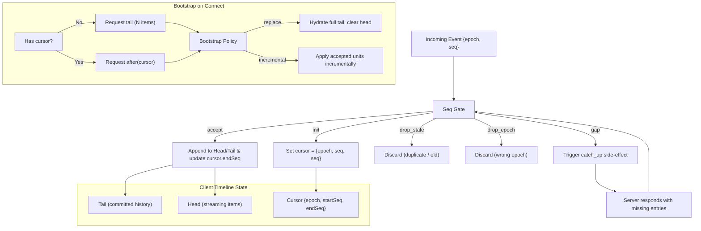

# Solo Timeline Design Deep Dive

> **Related Source Code**: `app/src/contexts/session-timeline-*.ts`, `app/src/types/stream.ts`, `app/src/contexts/session-stream-reducers.ts`, `app/src/stores/session-store.ts`

## 1. Design Goals

Solo's Timeline design addresses the following core challenges:

- **Streaming Conversation State Management**: Efficiently handle real-time streaming output from the Agent.
- **History Sync and Consistency**: Ensure client and server history remain consistent across disconnections, reconnections, app restoration, and initial load.
- **Race Condition Handling**: Manage timing conflicts between initialization requests (bootstrap) and live stream events.

---

## 2. Core Concepts

| Concept | Description |
|------|------|
| **Timeline** | An ordered sequence of events in the Agent's conversation history. Each event is globally uniquely identified by `epoch` + `seq`. |
| **Epoch** | Identifies a "generation" or version of a Timeline. Changes when the server resets or switches context. |
| **Seq** | A monotonically increasing sequence number used for strict ordering and continuity detection. |
| **Direction** | Timeline query direction: `tail` (end/history), `before` (prior), `after` (subsequent). |
| **Cursor** | The client's sync position marker, containing `{ epoch, startSeq, endSeq }`. |

---

## 3. Data Model: Head / Tail Double-Buffer Architecture

To optimize streaming rendering performance, the Timeline state is split into two parts:

| State | Meaning | Update Frequency | Persistence |
|------|------|----------|--------|
| **Tail** (`agentStreamTail`) | Committed conversation history (canonical) | Low (appended only on flush) | Persistent |
| **Head** (`agentStreamHead`) | Active content currently being streamed | High (updated per character/chunk) | Temporary |

### 3.1 Workflow

1. Streaming events (such as `assistant_message`, `thought`) are first written to the **Head**.
2. When the event type switches (for example, from `assistant_message` to `tool_call`) or a completion event is received (`turn_completed`/`turn_failed`/`turn_canceled`), the content in the Head is **Flushed** to the Tail.
3. This design avoids frequent copying of the entire history array during streaming output, updating only the temporary Head.

### 3.2 Markdown Block Promotion Optimization

When an `assistant_message` contains multiple Markdown code blocks during streaming, completed blocks are promoted to the Tail early (`promoteCompletedAssistantBlocks`), reducing the Head's volume and optimizing rendering performance.

---

## 4. Sequence Gate

All events entering the Timeline must pass a sequence number check to ensure correct ordering.

```
classifySessionTimelineSeq(cursor, epoch, seq):
  cursor is empty → "init"      (initialization)
  epoch mismatch  → "drop_epoch"(discard, wrong epoch)
  seq ≤ endSeq    → "drop_stale"(discard, stale/duplicate)
  seq = endSeq+1  → "accept"    (accept, contiguous)
  seq > endSeq+1  → "gap"       (gap, catch-up needed)
```

### Gap Handling

When a `gap` is detected, the system triggers a `catch_up` side effect to request the missing history fragment from the server (`requestCanonicalCatchUp`).

---

## 5. Initialization and Bootstrap Strategy

### 5.1 Initial Request Strategy

`deriveInitialTimelineRequest` determines the request method on first load:

- **Cold Start** (no cursor or no authoritative history): Request `direction: "tail"` to fetch the most recent N history entries.
- **Warm Recovery** (cursor exists): Request `direction: "after"` to fetch incremental updates since the cursor.

### 5.2 Bootstrap Tail Race Condition Handling

`deriveBootstrapTailTimelinePolicy` specifically handles a tricky race condition:

> **Scenario**: The client is initializing (sending a `tail` request) while the live stream is already pushing new events (seq may already be far beyond the tail range).

**Policy**:

| Condition | Behavior |
|------|------|
| `reset = true` | Full replacement (`replace: true`), no catch-up. |
| Bootstrap Tail Init (tail response during initialization) | `replace: true`, while recording `catchUpCursor` for subsequent backfill of live events missed during initialization. |
| Other cases | Incremental append (`replace: false`). |

### 5.3 Initialization Resolution

`shouldResolveTimelineInit` ensures the initialization Promise resolves only when a matching response arrives (`tail` request corresponds to `tail` response, preventing out-of-order response误触发初始化完成）。

---

## 6. Response Processing Flow

### 6.1 Batch Response Processing: `processTimelineResponse`

Handles batch Timeline data returned by the server (typically used for initialization or catch-up):

```
Input: payload (entries, direction, epoch, cursors)
      + current tail/head/cursor + initialization state

1. Error path: reject init, state unchanged
2. Convert entries to timelineUnits
3. Decide Replace or Incremental path based on bootstrapPolicy
   - Replace Path: hydrateStreamState → fully replace tail, clear head
   - Incremental Path: acceptIncrementalTimelineUnits one by one
     → contiguous events applyStreamEvent
     → record catchUpCursor when a gap is encountered
4. Add flush_pending_updates side effect
5. Resolve init deferred (if conditions are met)
```

### 6.2 Real-Time Event Processing: `processAgentStreamEvent`

Handles individual WebSocket real-time events:

```
1. Timeline Seq Gate check (if it is a timeline event)
   - init/accept → update cursor
   - gap → reject application, trigger catch_up
   - drop_stale/drop_epoch → discard directly
2. After passing the gate, applyStreamEvent (head/tail model)
3. Optimistic lifecycle updates (turn_completed and similar events update Agent state)
4. Return new state + side effects
```

---

## 7. Event Queue and Batching

To prevent high-frequency real-time events from causing frequent UI re-renders, the system uses a **Reducer Queue**:

- **Enqueue**: Events are grouped by Agent and enter the pending queue.
- **Schedule Flush**: Uses `setTimeout(48ms)` to batch flushes (approximately 20fps).
- **Flush**: Processes all events in the queue at once, generating a final state patch to reduce React re-render count.

---

## 8. StreamItem Type System

Each item in the Timeline is a `StreamItem` union type:

| Type | Purpose | Streamable |
|------|------|--------|
| `user_message` | User input | No |
| `assistant_message` | AI response | **Yes** |
| `thought` | Reasoning process | **Yes** |
| `tool_call` | Tool call | No |
| `todo_list` | Todo list | No |
| `activity_log` | System log | No |
| `compaction` | Context compaction marker | No |

**Source Marker**: Every event carries a `source` marker (`"live"` real-time stream / `"canonical"` authoritative history), used to distinguish data sources.

---

## 9. App Recovery and Catch-up

When the app resumes from the background (`handleAppResumed`):

1. If the time away exceeds `HISTORY_STALE_AFTER_MS` (60 seconds), increment the history sync generation.
2. If there is a cursor for the current Agent, send `fetchAgentTimeline(after, cursor)` to request catch-up incremental data.

---

## 10. Architecture Overview Diagram

### Mermaid Diagram



### ASCII Architecture Diagram (Plain Text Fallback)

```
┌─────────────────────────────────────────────────────────────────┐
│                    Client Timeline State                         │
├─────────────────────────────────────────────────────────────────┤
│  ┌─────────────────────┐  ┌─────────────────────┐              │
│  │  Tail               │  │  Head               │              │
│  │  (committed history)│  │  (streaming items)  │              │
│  └─────────────────────┘  └─────────────────────┘              │
│  ┌─────────────────────────────────────────────────────────┐   │
│  │  Cursor {epoch, startSeq, endSeq}                       │   │
│  └─────────────────────────────────────────────────────────┘   │
└─────────────────────────────────────────────────────────────────┘
                              │
                              ▼
┌─────────────────────────────────────────────────────────────────┐
│                        Seq Gate                                  │
├─────────────────────────────────────────────────────────────────┤
│  init      →  Set cursor = {epoch, seq, seq}                    │
│  accept    →  Append to Head/Tail & update cursor.endSeq        │
│  drop_stale → Discard (duplicate / old)                         │
│  drop_epoch → Discard (wrong epoch)                             │
│  gap       →  Trigger catch_up side-effect                      │
└─────────────────────────────────────────────────────────────────┘
                              │
                              ▼
┌─────────────────────────────────────────────────────────────────┐
│                     Bootstrap on Connect                         │
├─────────────────────────────────────────────────────────────────┤
│  Has cursor?                                                    │
│    ├─ No  → Request tail (N items) ──┐                          │
│    └─ Yes → Request after(cursor) ───┤                          │
│                                      ▼                          │
│                            Bootstrap Policy                     │
│                              ├─ replace → Hydrate full tail     │
│                              └─ incremental → Apply units       │
└─────────────────────────────────────────────────────────────────┘
```

---

## 11. Backend Storage and Multi-Device Sync

### 11.1 Shared Storage Model

The backend `InMemoryTimelineStore` is a **global shared singleton**; all Sessions share the same storage instance. `timeline` events produced during Agent execution are written to storage through the following path:

```
Agent Session (dispatcher)
  → subscribeToSession (workCh)
    → agentMgr.handleStreamEvent
      → m.emit(event)  ──→ Session A.handleStreamEvent ──→ timelineStore.Append
                          → Session B.handleStreamEvent ──→ timelineStore.Append
                          → Session C.handleStreamEvent ──→ timelineStore.Append
```

**Key Issue**: `m.emit()` synchronously and sequentially calls all Session subscribers. Each Session's `handleStreamEvent` independently calls `timelineStore.Append()` upon receiving a `timeline` event. If N Sessions are online simultaneously, the same timeline item will be appended **N times**.

### 11.2 Impact of Duplication

| Symptom | Root Cause |
|------|------|
| Multiple devices receive duplicate responses simultaneously | The same assistant_message is appended multiple times in timelineStore; the client fetches duplicate data when fetching timeline |
| App-side missing/confused Web-sent messages | Timeline duplication causes the frontend head/tail state machine sync logic to malfunction; optimistically updated user_message is overwritten or appended redundantly |

### 11.3 Idempotency Fix

`timelineStore.Append()` is now idempotent: before appending, it checks whether the **last record** is exactly the same as the current item; if so, it returns the existing row.

```go
func (s *InMemoryTimelineStore) Append(agentID string, item TimelineItem) TimelineRow {
    // ...
    if len(state.Rows) > 0 {
        last := state.Rows[len(state.Rows)-1]
        if timelineItemsEqual(last.Item, item) {
            return last  // Return existing record, do not create duplicate
        }
    }
    // Actually append new row
}
```

`timelineItemsEqual` compares precisely by type:
- `user_message` → Prefer comparing `MessageID`, otherwise compare `Text`
- `assistant_message` / `reasoning` → Compare `Text`
- `tool_call` → Compare `CallID + Status`

**Why is checking only the last record enough?**
Because `m.emit()` dispatches synchronously and sequentially; multiple Sessions' `Append()` calls for the same event occur almost consecutively in time. When the second Session calls, the last record is exactly the duplicate just appended by the first Session.

### 11.4 Related Source Code

- `daemon/internal/agent/timeline.go` — `Append()` idempotency logic
- `daemon/internal/agent/manager.go` — `emit()` synchronous broadcast
- `daemon/internal/server/session_agent_stream.go` — per-Session `handleStreamEvent`

---

## 12. Design Highlights Summary

1. **Head/Tail Double-Buffer**: Separates high-frequency streaming updates from low-frequency history commits for excellent performance.
2. **Strict Seq + Epoch Ordering**: Guarantees event order through monotonic sequence numbers and isolates different session generations through epoch.
3. **Automatic Gap Repair**: The client automatically triggers catch-up when a sequence gap is detected, ensuring no messages are lost.
4. **Bootstrap Race Safety**: The tail response during initialization replaces history and records a catch-up cursor, preventing message loss caused by race conditions.
5. **Batching Queue**: The 48ms batching window balances real-time responsiveness and rendering performance.
6. **Optimistic Lifecycle**: Optimistically updates Agent state at the stream event level (running → completed), making the UI more responsive.
7. **Backend Storage Idempotent Writes**: The `Append()` deduplication mechanism ensures timeline data is not duplicated during multi-device sync.
